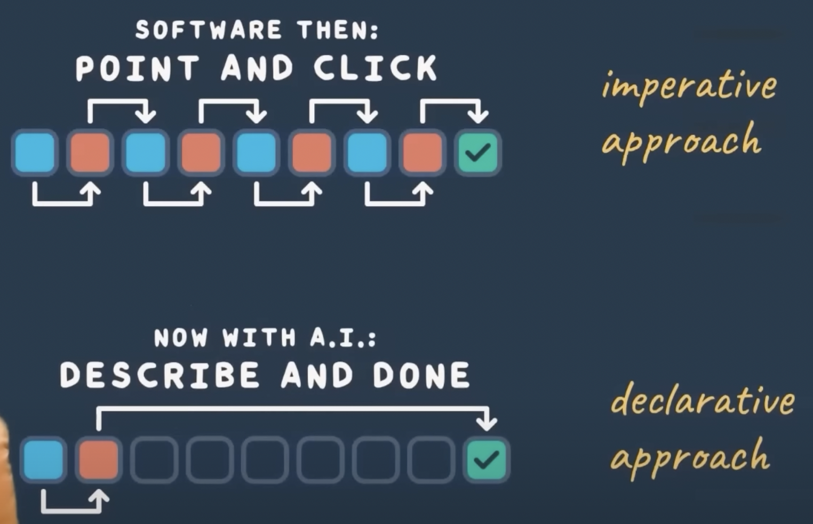
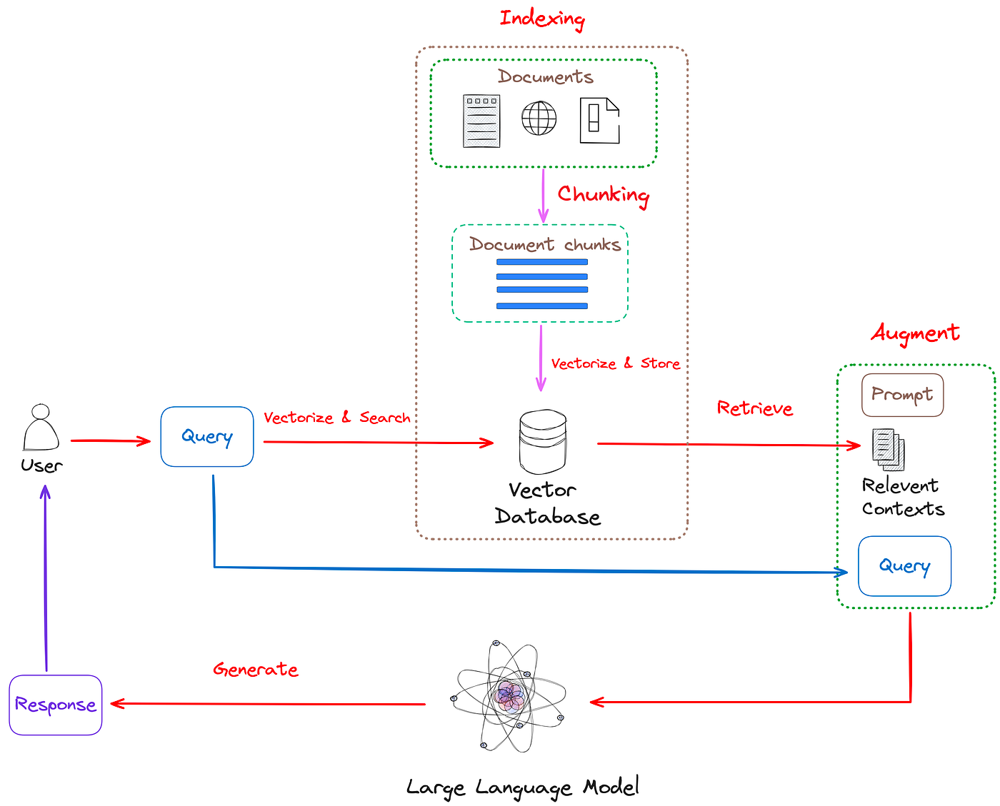

# Chatflow

Chatflow offers a chat interface for users to interact with any system using natural language.
Our engine understands the user's intent and executes the required
commands for the given task.

Users can easily navigate and utilize complex websites/products with multiple pages and
functionalities through a chat interface rather than using a point-and-click
approach.

You can try it out [here](http://apps.newaisolutions.com/)

Watch [this video](https://youtu.be/S_-6Oi1Zq1o?si=7TwD9pZq47uFMf1) to learn more.

Join our Discord to know what's going on in development and to ask questions to the maintainers about the project and how to contribute: https://discord.gg/fJ5ecMmsSf



## RAG architecture


## Running the App
Before running the app, please install Docker first

## Set up the environment

### Backend

- Start the databases
    ```bash
    docker-compose up -d redis
    ```
- Install the dependencies
    ```bash
    pip install -r requirements-dev.txt
    ```
- Navigate to the backend src cod 
    ```bash
    cd server/src
    ```
  
- Create a .env file and set all required variables
    ```bash
    cp server/src/.env.template server/src/.env
    ```
- Replace the OpenAI API key with your own key in the .env file
  
- Start the backend service locally
    ```bash
  # Start the server
   python server.py
    ```
  
- Visit http://localhost:8880/api/docs to see the API docs
- Access the Redis Vector DB UI on http://localhost:8001/redis-stack/browser


## Leave a star if you like the project
